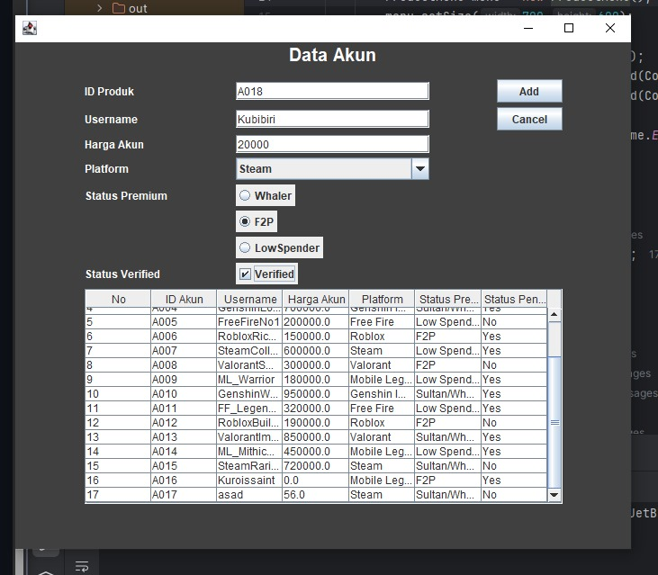
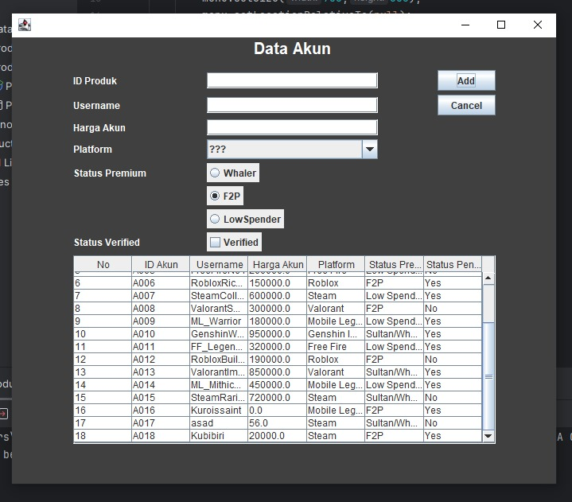
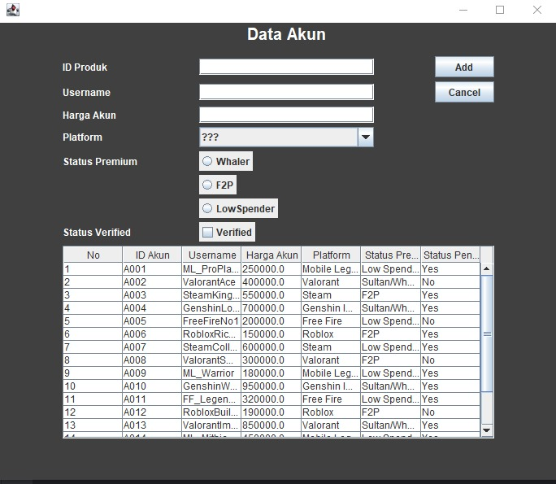
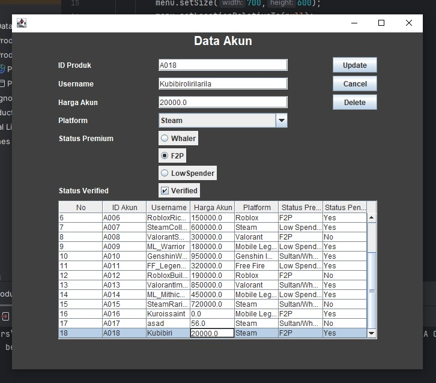
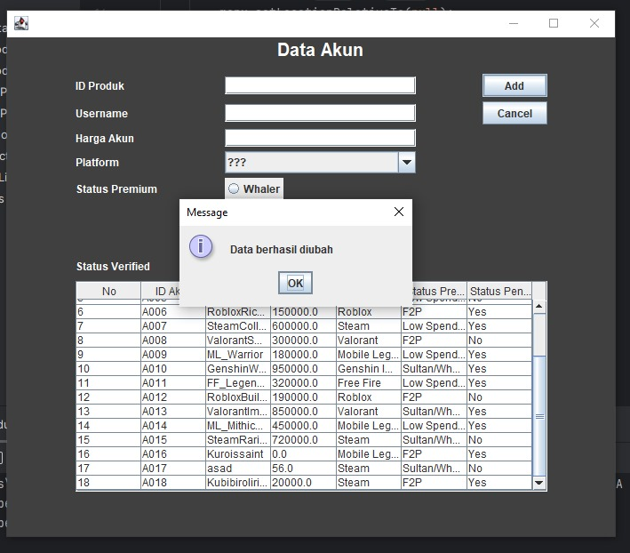
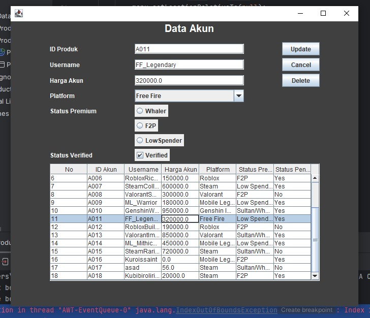
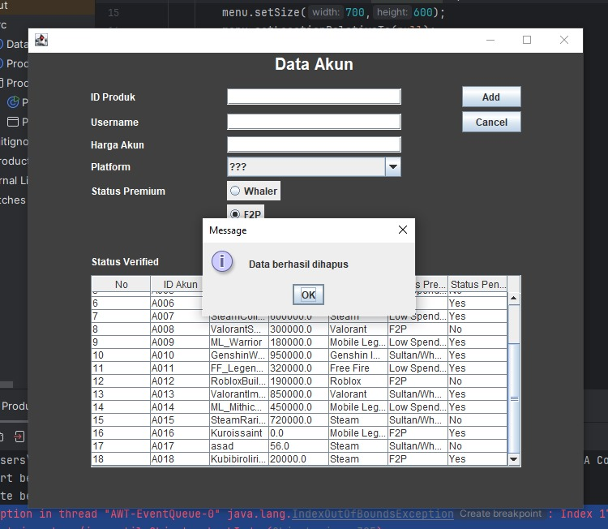
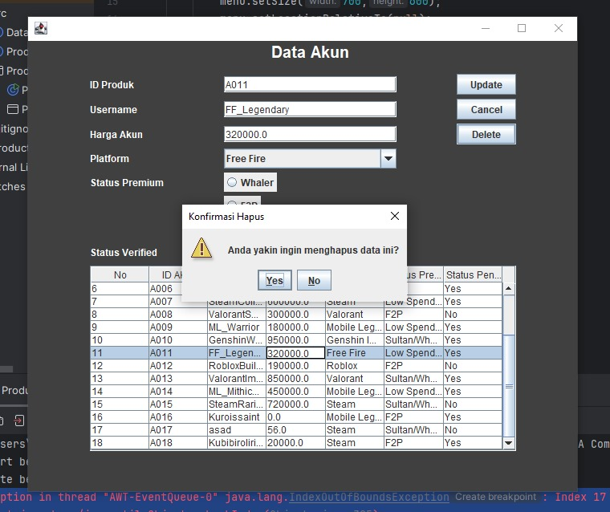
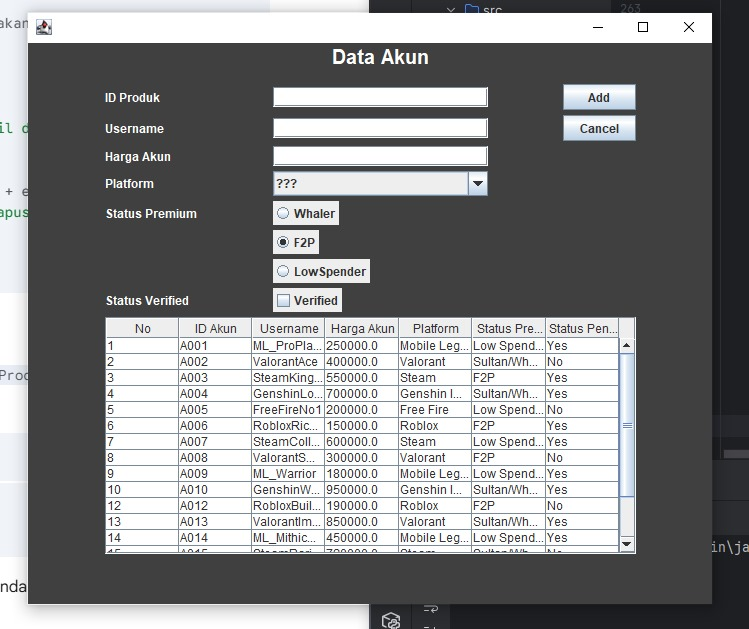

### Janji

Saya dengan nama Nafis Asyakir Anjar dan Nim 2407915 mengerjakan tugas praktikum 4 dalam mata kuliah Desain dan Pemrograman Berorientasi Objek untuk keberkahan-Nya maka saya tidak akan melakukan kecurangan seperti yang telah di spesifikasikan Aamiin.

---

### Desain

   Saya mengubah sedikit tema default yang diberikan menjadi Data Produk yang berupa Akun game. Secara keseluruhan, class dan atribut yang sudah ada tidak berubah.
   
1. Product
   Atribut :
      - No -> Penomoran untuk list data
      - ID -> Kode unik untuk setiap data
      - Username -> Nama akun yang akan dijual
      - Platform -> Game dari akun yang akan dijual
      - Status Premium -> Status akun tersebut (Dilihat dari banyaknya uang yang dikeluarkan untuk akun tersebut)
      - Status Penjual -> Status penjual akun tersebut apakah sudah terverifikasi atau belum
        
   Method :
      - Getter
      - Setter
       
2. Product Menu
   Class ini memiliki fungsi sebagai interface yang mengatur dan menampilkan semua komponen visual. Adapun komponen yang saya terapkan adalah:
   
   - JLabel untuk menambahkan teks penanda pada komponen lain agar memudahkan user
   - JtextField untuk ID, username, dan Harga Akun
   - JComboBox untuk Platform Game
   - JRadioButton untuk Status Premium akun
   - JCheckBox untuk Status Penjual yang terverifikasi
   - Jtable untuk menampilkan data produk
   - JButton untuk tombol Add, Update, Delete, dan Cancel

   Adapun Action Listener yang ada dalam class ini adalah:
   
   - InsertData() untuk menambahkan data
   - UpdateData() untuk memperbarui data yang sudah ada
   - DeleteData() untuk menghapus data
   - ClearForm() untuk menghapus/mengosongkan semua input yang belum dikonfirmasi (Cancel)
   - setTable() untuk Memasukkan data dari listProduct ke model tabel
   - populateList() untuk menambahkan data hardcode awal ke dalam listProduct
     

---

### Alur Program

1. Ketika kode dijalankan, akan menampilkan interface berupa form untuk data penjualan akun, dan tabel akun yang dijual.
2. User dapat mengisi form dan melakukan 2 aksi 
   a. Menekan button add - InsertData() - untuk menambahkan data ke dalam tabel data
   b. Menekan button cancel - ClearForm() - untuk mereset form menjadi kosongan
3. User dapat memilih salah satu baris data dalam tabel untuk melakukan 2 aksi
   a. Menekan button Update - UpdateData() - untuk memperbarui data setelah diedit
   b. Menekan button Delete - DeleteData() - untuk menghapus data dengan tambahan confirmation prompt

---

 ### Dokumentasi

1. Insert Data (CREATE)
   
   
3. Read Data (READ)
   
5. Update Data (UPDATE)
   
   
7. Delete Data (DELETE)
   
   
   
   
---
### TAMAT
